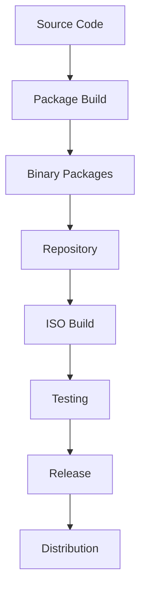

# Build System

This section covers creating a comprehensive, automated build system for your Linux distribution including package building, ISO creation, and release management.

## Table of Contents

1. [Build Architecture](#build-architecture)
2. [Build Environment Setup](#build-environment-setup)
3. [Package Build System](#package-build-system)
4. [ISO Build System](#iso-build-system)
5. [Build Automation](#build-automation)
6. [Quality Assurance](#quality-assurance)
7. [Build Monitoring](#build-monitoring)
8. [Build Optimization](#build-optimization)

## Build Architecture

### Build System Overview

```
Build System Architecture
├── Source Control
│   ├── Git repositories
│   ├── Package sources
│   └── Configuration files
├── Build Environment
│   ├── Mock chroots
│   ├── Build containers
│   └── Clean build spaces
├── Package Building
│   ├── Source packages
│   ├── Binary packages
│   └── Repository creation
├── ISO Creation
│   ├── Live system
│   ├── Install media
│   └── Update images
└── Release Management
    ├── Version control
    ├── Signing infrastructure
    └── Distribution channels
```

### Build Workflow



## Build Environment Setup

### Build Machine Configuration

#### System Requirements
```bash
# Minimum build system specifications
CPU: 16 cores (32 recommended)
RAM: 32GB (64GB recommended)
Storage: 500GB SSD (1TB recommended)
Network: 1Gbps connection

# Install build dependencies
dnf groupinstall -y "Development Tools"
dnf install -y \
  mock \
  createrepo \
  xorriso \
  syslinux \
  grub2-tools \
  qemu-kvm \
  libvirt \
  ansible \
  git
```

#### Build User Setup
```bash
# Create build user
useradd -m -s /bin/bash distro-builder
usermod -aG mock,distrowheel distro-builder

# Configure build environment
mkdir -p /opt/distro-build/{sources,packages,iso,logs,cache}
chown -R distro-builder:distro-builder /opt/distro-build

# Setup build user home
su - distro-builder
mkdir -p ~/build/{SOURCES,SPECS,BUILD,RPMS,SRPMS}
```

### Mock Configuration

#### Build Chroot Setup
Create `/etc/mock/distro-build.cfg`:
```ini
config_opts['root'] = 'distro-build'
config_opts['target_arch'] = 'x86_64'
config_opts['legal_host_arches'] = ('x86_64',)
config_opts['chroot_setup_cmd'] = 'install @buildsys-build'
config_opts['dist'] = 'el9'
config_opts['releasever'] = '9'
config_opts['package_manager'] = 'dnf'
config_opts['use_bootstrap'] = True

# Repository configuration
config_opts['yum.conf'] = """
[main]
keepcache=1
debuglevel=2
reposdir=/dev/null
logfile=/var/log/yum.log
retries=20
obsoletes=1
gpgcheck=0
assumeyes=1
syslog_ident=mock
syslog_device=

# Base repositories
[baseos]
name=Oracle Linux BaseOS
baseurl=https://yum.oracle.com/repo/OracleLinux/ol9/baseos/latest/x86_64/
gpgcheck=1
gpgkey=file:///etc/pki/rpm-gpg/RPM-GPG-KEY-oracle

[appstream]
name=Oracle Linux AppStream
baseurl=https://yum.oracle.com/repo/OracleLinux/ol9/appstream/latest/x86_64/
gpgcheck=1
gpgkey=file:///etc/pki/rpm-gpg/RPM-GPG-KEY-oracle

[distro-local]
name=Distro Local Repository
baseurl=file:///opt/distro-repo
gpgcheck=0
"""
```

#### Custom Mock Configuration
Create `/etc/mock/distro-build-custom.cfg`:
```ini
# Include base configuration
include('/etc/mock/distro-build.cfg')

# Custom build options
config_opts['chroot_additional_packages'] = [
    'distro-build-tools',
    'distro-branding',
    'python3-distro-build'
]

# Build optimization
config_opts['macros']['%_smp_mflags'] = '-j16'
config_opts['macros']['%_parallel_make'] = '1'
config_opts['macros']['%_make_jobs'] = '16'

# Sign packages after build
config_opts['plugin_conf']['sign_enable'] = True
config_opts['plugin_conf']['sign_opts'] = '--define="%__gpg_sign_cmd %{__gpg_sign_cmd} --batch --no-armor --passphrase %{_gpg_passphrase}"'
```

### Containerized Build Environment

#### Docker Build Container
Create `Dockerfile.distro-build`:
```dockerfile
FROM oraclelinux:9

# Install build dependencies
RUN dnf groupinstall -y "Development Tools" && \
    dnf install -y \
        mock \
        createrepo \
        xorriso \
        syslinux \
        grub2-tools \
        git \
        python3 \
        python3-pip && \
    dnf clean all

# Create build user
RUN useradd -m -s /bin/bash builder && \
    usermod -aG mock builder

# Install custom build tools
COPY requirements.txt /tmp/
RUN pip3 install -r /tmp/requirements.txt

# Set up build directories
RUN mkdir -p /opt/distro-build && \
    chown -R builder:builder /opt/distro-build

USER builder
WORKDIR /home/builder

# Copy build scripts
COPY --chown=builder:builder scripts/ /home/builder/scripts/
```

#### Build Container Management
Create `scripts/container-build.sh`:
```bash
#!/bin/bash
# Container build script

CONTAINER_NAME="distro-build"
IMAGE_NAME="distro-build:latest"

# Build container image
docker build -f Dockerfile.distro-build -t $IMAGE_NAME .

# Run build in container
docker run --rm \
    -v /opt/distro-build:/opt/distro-build \
    -v /opt/distro-repo:/opt/distro-repo \
    --name $CONTAINER_NAME \
    $IMAGE_NAME \
    /home/builder/scripts/build-all.sh
```

## Package Build System

### Source Management

#### Git Repository Structure
```bash
# Package source repositories
mkdir -p ~/distro-sources/{core,desktop,applications,tools}

# Initialize package repositories
cd ~/distro-sources/core
git init distro-release
git init distro-config
git init distro-branding

cd ~/distro-sources/desktop
git init distro-desktop
git init distro-themes

cd ~/distro-sources/applications
git init distro-tools
git init distro-center
```

#### Package Source Templates
Create `scripts/create-package.sh`:
```bash
#!/bin/bash
# Create new package template

PACKAGE_NAME=$1
VERSION=$2
if [ -z "$PACKAGE_NAME" ] || [ -z "$VERSION" ]; then
    echo "Usage: $0 <package-name> <version>"
    exit 1
fi

# Create package directory
mkdir -p ~/distro-sources/$PACKAGE_NAME
cd ~/distro-sources/$PACKAGE_NAME

# Initialize git repository
git init

# Create spec file template
cat > ${PACKAGE_NAME}.spec <<EOF
Name:           $PACKAGE_NAME
Version:        $VERSION
Release:        1%{?dist}
Summary:        $PACKAGE_NAME package for Distro

License:        GPL-2.0-or-later
URL:            https://github.com/distro/$PACKAGE_NAME
Source0:        %{name}-%{version}.tar.gz

BuildArch:      noarch

%description
$PACKAGE_NAME package for Distro Linux.

%prep
%autosetup

%build
# Build commands here

%install
rm -rf %{buildroot}
# Install commands here

%files
# File list here

%changelog
* $(date +'%a %b %d %Y') Distro Builder <builder@distro.local> - $VERSION-1
- Initial package
EOF

# Create source directory
mkdir -p ${PACKAGE_NAME}-${VERSION}
cd ${PACKAGE_NAME}-${VERSION}

# Create basic source files
cat > README.md <<EOF
# $PACKAGE_NAME

$PACKAGE_NAME for Distro Linux.

## Installation

This package is installed as part of Distro Linux.

## Usage

Usage instructions here.
EOF

# Create Makefile if needed
cat > Makefile <<'EOF'
all:
	@echo "Building $(PACKAGE_NAME)"

install:
	@echo "Installing $(PACKAGE_NAME)"

clean:
	@echo "Cleaning $(PACKAGE_NAME)"
EOF

cd ..

# Create build script
cat > build.sh <<'EOF'
#!/bin/bash
# Build script for package

set -e

# Get version from spec file
VERSION=$(grep "^Version:" *.spec | awk '{print $2}')

# Create source tarball
tar -czf ${PACKAGE_NAME}-${VERSION}.tar.gz \
    ${PACKAGE_NAME}-${VERSION}/

# Build package
rpmbuild -ba *.spec

echo "Package built successfully"
EOF

chmod +x build.sh

# Initialize git repository
git add .
git commit -m "Initial commit: $PACKAGE_NAME $VERSION"

echo "Package $PACKAGE_NAME created successfully"
echo "Directory: $(pwd)"
```

### Automated Package Building

#### Build Queue System
Create `scripts/build-queue.sh`:
```bash
#!/bin/bash
# Package build queue system

BUILD_DIR="/opt/distro-build"
QUEUE_FILE="$BUILD_DIR/build.queue"
LOG_DIR="$BUILD_DIR/logs"

# Ensure directories exist
mkdir -p "$BUILD_DIR" "$LOG_DIR"

# Add package to build queue
add_to_queue() {
    local package=$1
    local priority=${2:-5}
    
    echo "$priority:$package" >> "$QUEUE_FILE"
    echo "Added $package to build queue with priority $priority"
}

# Process build queue
process_queue() {
    if [ ! -f "$QUEUE_FILE" ]; then
        echo "No packages in build queue"
        return
    fi
    
    # Sort queue by priority (lower number = higher priority)
    sort -n -t: -k1 "$QUEUE_FILE" | while IFS=: read -r priority package; do
        echo "Building $package (priority: $priority)"
        
        # Build package
        if build_package "$package"; then
            echo "Successfully built $package"
            # Remove from queue
            sed -i "/$package/d" "$QUEUE_FILE"
        else
            echo "Failed to build $package"
            # Log failure but keep in queue for retry
        fi
    done
}

# Build individual package
build_package() {
    local package=$1
    local log_file="$LOG_DIR/${package}.log"
    
    echo "Starting build of $package at $(date)" | tee "$log_file"
    
    # Change to package directory
    cd "$BUILD_DIR/sources/$package" || {
        echo "Package directory not found: $package" | tee -a "$log_file"
        return 1
    }
    
    # Build with mock
    mock -r distro-build --buildsrpm --spec "$package.spec" \
        --source "$package-$(grep '^Version:' "$package.spec" | awk '{print $2}').tar.gz" \
        --resultdir="$BUILD_DIR/packages" >> "$log_file" 2>&1
    
    if [ $? -eq 0 ]; then
        # Build binary package
        mock -r distro-build --rebuild \
            "$BUILD_DIR/packages/$package-*.src.rpm" \
            --resultdir="$BUILD_DIR/packages" >> "$log_file" 2>&1
        
        if [ $? -eq 0 ]; then
            echo "Package $package built successfully" | tee -a "$log_file"
            return 0
        fi
    fi
    
    echo "Package $package build failed" | tee -a "$log_file"
    return 1
}

# Main execution
case "$1" in
    add)
        add_to_queue "$2" "$3"
        ;;
    process)
        process_queue
        ;;
    *)
        echo "Usage: $0 {add|process} [package] [priority]"
        exit 1
        ;;
esac
```

#### Dependency Resolution
Create `scripts/resolve-deps.sh`:
```bash
#!/bin/bash
# Dependency resolution for packages

PACKAGE_LIST=$1
BUILD_DEPS_FILE="build-deps.txt"

# Extract build dependencies
extract_build_deps() {
    local spec_file=$1
    
    # Extract BuildRequires from spec file
    grep "^BuildRequires:" "$spec_file" | \
        sed 's/BuildRequires://' | \
        tr ',' '\n' | \
        sed 's/^[[:space:]]*//' | \
        sed 's/[[:space:]]*$//' | \
        grep -v '^$'
}

# Resolve dependencies for all packages
resolve_all_deps() {
    echo "Resolving dependencies for all packages..."
    
    # Clear previous dependencies
    > "$BUILD_DEPS_FILE"
    
    while IFS= read -r package; do
        if [ -f "$package/$package.spec" ]; then
            echo "Resolving dependencies for $package..."
            extract_build_deps "$package/$package.spec" >> "$BUILD_DEPS_FILE"
        fi
    done < "$PACKAGE_LIST"
    
    # Sort and remove duplicates
    sort -u "$BUILD_DEPS_FILE" -o "$BUILD_DEPS_FILE"
    
    echo "Dependencies written to $BUILD_DEPS_FILE"
}

# Install build dependencies
install_build_deps() {
    echo "Installing build dependencies..."
    
    if [ -f "$BUILD_DEPS_FILE" ]; then
        sudo dnf builddep "$BUILD_DEPS_FILE"
    else
        echo "No dependencies file found"
    fi
}

# Main execution
case "$1" in
    extract)
        extract_build_deps "$2"
        ;;
    resolve)
        resolve_all_deps
        ;;
    install)
        install_build_deps
        ;;
    *)
        echo "Usage: $0 {extract|resolve|install} [spec-file]"
        exit 1
        ;;
esac
```

## ISO Build System

### Live System Build

#### Kickstart Configuration
Create `config/distro-live.ks`:
```kickstart
# Distro Live System Kickstart

# System language
lang en_US.UTF-8

# Keyboard layouts
keyboard --vckeymap=us --xlayouts='us'

# System timezone
timezone America/New_York --isUtc

# Network configuration
network --bootproto=dhcp --device=link --activate

# Root password
rootpw --lock

# System authorization information
auth --enableshadow --passalgo=sha512

# SELinux configuration
selinux --enforcing

# Firewall configuration
firewall --enabled --service=ssh

# System services
services --enabled="NetworkManager,sshd,firewalld"

# Repository configuration
repo --name="base" --baseurl=file:///opt/distro-repo --cost=100

# Package selection
%packages
@core
@standard
@desktop-platform
@fonts
@input-methods
@multimedia
@guest-desktop-agents

# Distro-specific packages
distro-release
distro-config
distro-branding
distro-desktop
distro-themes

# Desktop environment
gnome-shell
gnome-session
gdm
nautilus
gnome-terminal
firefox
libreoffice-writer

# Remove unwanted packages
-remove=@printing
-remove=scdaemon
%end

# Post-installation configuration
%post
# Distro post-install script
/usr/local/bin/distro-postinstall

# Enable services
systemctl enable gdm
systemctl enable NetworkManager

# Create live user
useradd -m -s /bin/bash liveuser
echo "liveuser:liveuser" | chpasswd
usermod -aG wheel liveuser

# Configure desktop for live user
cp /usr/share/distro/config/user-profile.sh /home/liveuser/.profile
chown liveuser:liveuser /home/liveuser/.profile
%end
```

#### Live Build Script
Create `scripts/build-live.sh`:
```bash
#!/bin/bash
# Live ISO build script

set -e

# Configuration
LIVE_NAME="distro-live"
LIVE_VERSION="1.0"
BUILD_DIR="/opt/distro-build"
KICKSTART_FILE="$BUILD_DIR/config/distro-live.ks"
OUTPUT_DIR="$BUILD_DIR/iso"

# Create build directories
mkdir -p "$BUILD_DIR/live" "$OUTPUT_DIR"

echo "Building Live ISO..."

# Create live system with lorax
lorax -p "$LIVE_NAME" \
    -v "$LIVE_VERSION" \
    -r 9 \
    -t "$BUILD_DIR/tmp" \
    -c "$KICKSTART_FILE" \
    --buildarch=x86_64 \
    "$BUILD_DIR/live"

# Create bootable ISO
cd "$BUILD_DIR/live"

# Create ISO with xorriso
xorriso -as mkisofs \
    -iso-level 3 \
    -full-iso9660-filenames \
    -volid "Distro Live $LIVE_VERSION" \
    -appid "Distro Live" \
    -publisher "Distro Project" \
    -preparer "Distro Build System" \
    -eltorito-boot isolinux.bin \
    -eltorito-catalog isolinux.cat \
    -no-emul-boot -boot-load-size 4 -boot-info-table \
    -output "$OUTPUT_DIR/distro-live-$LIVE_VERSION-x86_64.iso" \
    .

# Create checksum
cd "$OUTPUT_DIR"
sha256sum "distro-live-$LIVE_VERSION-x86_64.iso" > "distro-live-$LIVE_VERSION-x86_64.iso.sha256"

echo "Live ISO built successfully:"
echo "  Location: $OUTPUT_DIR/distro-live-$LIVE_VERSION-x86_64.iso"
echo "  Size: $(du -h "$OUTPUT_DIR/distro-live-$LIVE_VERSION-x86_64.iso" | cut -f1)"
```

### Install Media Build

#### Install ISO Script
Create `scripts/build-install.sh`:
```bash
#!/bin/bash
# Install ISO build script

set -e

# Configuration
INSTALL_NAME="distro-install"
INSTALL_VERSION="1.0"
BUILD_DIR="/opt/distro-build"
PACKAGE_DIR="/opt/distro-repo"
OUTPUT_DIR="$BUILD_DIR/iso"

echo "Building Install ISO..."

# Create install tree
mkdir -p "$BUILD_DIR/install-tree"

# Install packages to install tree
dnf --installroot="$BUILD_DIR/install-tree" \
    --releasever=9 \
    --setopt=install_weak_deps=False \
    install -y \
    @core \
    @standard \
    anaconda \
    dracut \
    kernel \
    distro-release \
    distro-config \
    distro-branding

# Configure install system
chroot "$BUILD_DIR/install-tree" /bin/bash <<'EOF'
# Enable services
systemctl enable sshd
systemctl enable NetworkManager

# Configure anaconda
echo "LANG=en_US.UTF-8" > /etc/locale.conf
echo "KEYTABLE=us" > /etc/sysconfig/keyboard
EOF

# Create repository configuration
mkdir -p "$BUILD_DIR/install-tree/etc/yum.repos.d"
cat > "$BUILD_DIR/install-tree/etc/yum.repos.d/distro.repo" <<EOF
[distro]
name=Distro Repository
baseurl=file:///mnt/source/repo
enabled=1
gpgcheck=0
EOF

# Create boot files
mkdir -p "$BUILD_DIR/install-tree/boot/grub2"
cp "$BUILD_DIR/install-tree/boot/vmlinuz-"* \
   "$BUILD_DIR/install-tree/boot/grub2/vmlinuz"
cp "$BUILD_DIR/install-tree/boot/initramfs-"* \
   "$BUILD_DIR/install-tree/boot/grub2/initrd.img"

# Create GRUB configuration
cat > "$BUILD_DIR/install-tree/boot/grub2/grub.cfg" <<EOF
set default="0"
set timeout=10

menuentry "Install Distro Linux" {
    linux /grub2/vmlinuz inst.repo=hd:LABEL=Distro:/repo quiet
    initrd /grub2/initrd.img
}

menuentry "Test this media" {
    linux /grub2/vmlinuz rd.live.check quiet
    initrd /grub2/initrd.img
}
EOF

# Create install ISO
cd "$BUILD_DIR"

xorriso -as mkisofs \
    -iso-level 3 \
    -full-iso9660-filenames \
    -volid "Distro Install $INSTALL_VERSION" \
    -appid "Distro Install" \
    -publisher "Distro Project" \
    -preparer "Distro Build System" \
    -b boot/grub2/eltorito.img \
    -no-emul-boot -boot-load-size 4 -boot-info-table \
    -eltorito-alt-boot -e boot/grub2/efiboot.img -no-emul-boot \
    -isohybrid-gpt-basdat \
    -output "$OUTPUT_DIR/distro-install-$INSTALL_VERSION-x86_64.iso" \
    install-tree/

# Create checksum
cd "$OUTPUT_DIR"
sha256sum "distro-install-$INSTALL_VERSION-x86_64.iso" > "distro-install-$INSTALL_VERSION-x86_64.iso.sha256"

echo "Install ISO built successfully:"
echo "  Location: $OUTPUT_DIR/distro-install-$INSTALL_VERSION-x86_64.iso"
echo "  Size: $(du -h "$OUTPUT_DIR/distro-install-$INSTALL_VERSION-x86_64.iso" | cut -f1)"
```

## Build Automation

### CI/CD Pipeline

#### Jenkins Pipeline
Create `Jenkinsfile`:
```groovy
pipeline {
    agent any
    
    environment {
        BUILD_DIR = '/opt/distro-build'
        REPO_DIR = '/opt/distro-repo'
    }
    
    stages {
        stage('Checkout') {
            steps {
                checkout scm
            }
        }
        
        stage('Build Dependencies') {
            steps {
                sh 'scripts/install-build-deps.sh'
            }
        }
        
        stage('Build Packages') {
            parallel {
                stage('Core Packages') {
                    steps {
                        sh 'scripts/build-packages.sh core'
                    }
                }
                stage('Desktop Packages') {
                    steps {
                        sh 'scripts/build-packages.sh desktop'
                    }
                }
                stage('Application Packages') {
                    steps {
                        sh 'scripts/build-packages.sh applications'
                    }
                }
            }
        }
        
        stage('Create Repository') {
            steps {
                sh 'scripts/create-repo.sh'
            }
        }
        
        stage('Build ISO') {
            parallel {
                stage('Live ISO') {
                    steps {
                        sh 'scripts/build-live.sh'
                    }
                }
                stage('Install ISO') {
                    steps {
                        sh 'scripts/build-install.sh'
                    }
                }
            }
        }
        
        stage('Test') {
            steps {
                sh 'scripts/test-iso.sh'
            }
        }
        
        stage('Sign') {
            steps {
                sh 'scripts/sign-release.sh'
            }
        }
    }
    
    post {
        success {
            archiveArtifacts artifacts: 'iso/*.iso, iso/*.sha256', fingerprint: true
            publishHTML([
                allowMissing: false,
                alwaysLinkToLastBuild: true,
                keepAll: true,
                reportDir: 'reports',
                reportFiles: 'index.html',
                reportName: 'Build Report',
                reportTitles: ''
            ])
        }
        failure {
            mail to: 'build-team@distro.local',
                 subject: "Build Failed: ${env.JOB_NAME} - ${env.BUILD_NUMBER}",
                 body: "Build failed. Check console output for details."
        }
    }
}
```

#### GitLab CI/CD
Create `.gitlab-ci.yml`:
```yaml
stages:
  - prepare
  - build
  - test
  - deploy

variables:
  BUILD_DIR: "/opt/distro-build"
  REPO_DIR: "/opt/distro-repo"

prepare:
  stage: prepare
  script:
    - scripts/setup-build-env.sh
  artifacts:
    paths:
      - build-env/

build_packages:
  stage: build
  script:
    - scripts/build-all-packages.sh
  artifacts:
    paths:
      - packages/
  dependencies:
    - prepare

build_iso:
  stage: build
  script:
    - scripts/build-all-iso.sh
  artifacts:
    paths:
      - iso/*.iso
      - iso/*.sha256
  dependencies:
    - prepare

test_iso:
  stage: test
  script:
    - scripts/test-iso.sh
  dependencies:
    - build_iso

deploy_release:
  stage: deploy
  script:
    - scripts/deploy-release.sh
  only:
    - tags
  dependencies:
    - build_packages
    - build_iso
    - test_iso
```

### Build Scripts

#### Master Build Script
Create `scripts/build-all.sh`:
```bash
#!/bin/bash
# Master build script

set -e

# Configuration
BUILD_DIR="/opt/distro-build"
LOG_DIR="$BUILD_DIR/logs"
TIMESTAMP=$(date +%Y%m%d-%H%M%S)
MASTER_LOG="$LOG_DIR/build-$TIMESTAMP.log"

# Ensure log directory exists
mkdir -p "$LOG_DIR"

echo "Starting master build at $(date)" | tee "$MASTER_LOG"

# Function to log with timestamp
log() {
    echo "[$(date '+%Y-%m-%d %H:%M:%S')] $1" | tee -a "$MASTER_LOG"
}

# Function to handle errors
handle_error() {
    log "ERROR: Build failed at stage $1"
    log "Check log file: $MASTER_LOG"
    exit 1
}

# Build stages
build_stage() {
    local stage=$1
    local script=$2
    
    log "Starting stage: $stage"
    
    if ! bash "$script" >> "$MASTER_LOG" 2>&1; then
        handle_error "$stage"
    fi
    
    log "Completed stage: $stage"
}

# Execute build stages
build_stage "Environment Setup" "scripts/setup-build-env.sh"
build_stage "Package Building" "scripts/build-all-packages.sh"
build_stage "Repository Creation" "scripts/create-repo.sh"
build_stage "ISO Building" "scripts/build-all-iso.sh"
build_stage "Testing" "scripts/test-all.sh"
build_stage "Signing" "scripts/sign-release.sh"

log "Master build completed successfully"
log "Artifacts location: $BUILD_DIR"

# Generate build report
scripts/generate-build-report.sh "$MASTER_LOG"

echo "Build completed successfully. See $MASTER_LOG for details."
```

#### Build Report Generator
Create `scripts/generate-build-report.sh`:
```bash
#!/bin/bash
# Build report generator

LOG_FILE=$1
REPORT_FILE="${LOG_FILE%.log}-report.html"

if [ -z "$LOG_FILE" ] || [ ! -f "$LOG_FILE" ]; then
    echo "Usage: $0 <log-file>"
    exit 1
fi

# Extract build information
BUILD_START=$(grep "Starting master build" "$LOG_FILE" | cut -d']' -f2 | cut -d' ' -f2-)
BUILD_END=$(grep "Master build completed" "$LOG_FILE" | cut -d']' -f2 | cut -d' ' -f2-)
PACKAGES_BUILT=$(grep -c "Successfully built" "$LOG_FILE")
PACKAGES_FAILED=$(grep -c "build failed" "$LOG_FILE")
ISO_SIZE=$(du -h /opt/distro-build/iso/*.iso 2>/dev/null | tail -1 | cut -f1)

# Generate HTML report
cat > "$REPORT_FILE" <<EOF
<!DOCTYPE html>
<html>
<head>
    <title>Distro Build Report</title>
    <style>
        body { font-family: Arial, sans-serif; margin: 20px; }
        .header { background-color: #2E7D32; color: white; padding: 20px; border-radius: 5px; }
        .section { margin: 20px 0; padding: 15px; border: 1px solid #ddd; border-radius: 5px; }
        .success { color: #2E7D32; }
        .error { color: #D32F2F; }
        .info { color: #1976D2; }
        table { width: 100%; border-collapse: collapse; }
        th, td { padding: 10px; text-align: left; border-bottom: 1px solid #ddd; }
        th { background-color: #f5f5f5; }
    </style>
</head>
<body>
    <div class="header">
        <h1>Distro Build Report</h1>
        <p>Generated on $(date)</p>
    </div>
    
    <div class="section">
        <h2>Build Summary</h2>
        <table>
            <tr><th>Build Start</th><td>$BUILD_START</td></tr>
            <tr><th>Build End</th><td>$BUILD_END</td></tr>
            <tr><th>Packages Built</th><td class="success">$PACKAGES_BUILT</td></tr>
            <tr><th>Packages Failed</th><td class="error">$PACKAGES_FAILED</td></tr>
            <tr><th>ISO Size</th><td class="info">$ISO_SIZE</td></tr>
        </table>
    </div>
    
    <div class="section">
        <h2>Build Log</h2>
        <pre style="background-color: #f5f5f5; padding: 10px; overflow: auto; max-height: 400px;">
$(tail -100 "$LOG_FILE")
        </pre>
    </div>
    
    <div class="section">
        <h2>Artifacts</h2>
        <ul>
            <li><a href="iso/distro-live-1.0-x86_64.iso">Live ISO</a></li>
            <li><a href="iso/distro-install-1.0-x86_64.iso">Install ISO</a></li>
            <li><a href="packages/">Package Repository</a></li>
        </ul>
    </div>
</body>
</html>
EOF

echo "Build report generated: $REPORT_FILE"
```

## Quality Assurance

### Automated Testing

#### ISO Testing Script
Create `scripts/test-iso.sh`:
```bash
#!/bin/bash
# ISO testing script

set -e

ISO_FILE=$1
TEST_DIR="/opt/distro-build/tests"

if [ -z "$ISO_FILE" ] || [ ! -f "$ISO_FILE" ]; then
    echo "Usage: $0 <iso-file>"
    exit 1
fi

echo "Testing ISO: $ISO_FILE"

# Create test directory
mkdir -p "$TEST_DIR"

# Test 1: ISO integrity
echo "Test 1: Checking ISO integrity..."
if ! isoinfo -i "$ISO_FILE" -d > /dev/null; then
    echo "ERROR: ISO file is corrupted"
    exit 1
fi
echo "PASS: ISO integrity check"

# Test 2: Boot test with QEMU
echo "Test 2: Testing boot capability..."
qemu-system-x86_64 \
    -m 1024 \
    -cdrom "$ISO_FILE" \
    -boot d \
    -nographic \
    -serial file:"$TEST_DIR/boot.log" \
    -monitor none \
    -daemonize

# Wait for boot and check
sleep 30
if grep -q "kernel panic" "$TEST_DIR/boot.log"; then
    echo "ERROR: Kernel panic during boot"
    exit 1
fi
echo "PASS: Boot test"

# Test 3: Package verification
echo "Test 3: Verifying packages..."
if [ -d "/mnt/iso" ]; then
    umount /mnt/iso
fi
mkdir -p /mnt/iso
mount -o loop "$ISO_FILE" /mnt/iso

if [ -d "/mnt/iso/repo" ]; then
    # Check repository metadata
    if ! repomd /mnt/iso/repo/repodata/repomd.xml > /dev/null; then
        echo "ERROR: Repository metadata is invalid"
        umount /mnt/iso
        exit 1
    fi
    echo "PASS: Package verification"
else
    echo "WARNING: No repository found on ISO"
fi

umount /mnt/iso

# Test 4: File system check
echo "Test 4: File system check..."
file_count=$(isoinfo -f -i "$ISO_FILE" | wc -l)
if [ "$file_count" -lt 100 ]; then
    echo "ERROR: Too few files on ISO ($file_count)"
    exit 1
fi
echo "PASS: File system check ($file_count files)"

echo "All tests passed successfully"
```

#### Package Testing
Create `scripts/test-packages.sh`:
```bash
#!/bin/bash
# Package testing script

REPO_DIR="/opt/distro-repo"
TEST_DIR="/opt/distro-build/test-root"

echo "Testing packages in repository: $REPO_DIR"

# Create test root
mkdir -p "$TEST_DIR"

# Test package installation
test_package_install() {
    local package=$1
    
    echo "Testing package: $package"
    
    # Install package in test root
    if ! dnf --installroot="$TEST_DIR" install -y "$package"; then
        echo "ERROR: Failed to install $package"
        return 1
    fi
    
    # Check package files
    if ! rpm --root="$TEST_DIR" -ql "$package" > /dev/null; then
        echo "ERROR: Package $package has no files"
        return 1
    fi
    
    # Check dependencies
    if ! rpm --root="$TEST_DIR" --checksig "$package" > /dev/null; then
        echo "WARNING: Package $package signature check failed"
    fi
    
    echo "PASS: $package"
    return 0
}

# Test all packages
failed_packages=0
total_packages=0

for rpm_file in "$REPO_DIR"/RPMS/*/*.rpm; do
    if [ -f "$rpm_file" ]; then
        package_name=$(basename "$rpm_file" .rpm)
        total_packages=$((total_packages + 1))
        
        if ! test_package_install "$package_name"; then
            failed_packages=$((failed_packages + 1))
        fi
        
        # Clean test root
        rm -rf "$TEST_DIR"/*
    fi
done

echo "Package testing completed:"
echo "  Total packages: $total_packages"
echo "  Failed packages: $failed_packages"
echo "  Success rate: $(( (total_packages - failed_packages) * 100 / total_packages ))%"

if [ "$failed_packages" -gt 0 ]; then
    exit 1
fi
```

## Build Monitoring

### Build Metrics

#### Monitoring Script
Create `scripts/monitor-build.sh`:
```bash
#!/bin/bash
# Build monitoring script

METRICS_FILE="/opt/distro-build/metrics.json"
BUILD_DIR="/opt/distro-build"

# Collect build metrics
collect_metrics() {
    local timestamp=$(date -Iseconds)
    
    # System metrics
    local cpu_usage=$(top -bn1 | grep "Cpu(s)" | awk '{print $2}' | cut -d'%' -f1)
    local memory_usage=$(free | awk '/^Mem:/ {printf "%.1f", $3/$2 * 100.0}')
    local disk_usage=$(df "$BUILD_DIR" | awk 'NR==2 {print $5}' | cut -d'%' -f1)
    
    # Build metrics
    local packages_count=$(find "$BUILD_DIR/packages" -name "*.rpm" 2>/dev/null | wc -l)
    local iso_count=$(find "$BUILD_DIR/iso" -name "*.iso" 2>/dev/null | wc -l)
    local build_log_size=$(du -s "$BUILD_DIR/logs" 2>/dev/null | awk '{print $1}' || echo "0")
    
    # Create JSON metrics
    cat > "$METRICS_FILE" <<EOF
{
    "timestamp": "$timestamp",
    "system": {
        "cpu_usage": $cpu_usage,
        "memory_usage": $memory_usage,
        "disk_usage": $disk_usage
    },
    "build": {
        "packages_count": $packages_count,
        "iso_count": $iso_count,
        "log_size_kb": $build_log_size
    }
}
EOF
}

# Alert on thresholds
check_alerts() {
    local cpu_usage=$(jq -r '.system.cpu_usage' "$METRICS_FILE")
    local memory_usage=$(jq -r '.system.memory_usage' "$METRICS_FILE")
    local disk_usage=$(jq -r '.system.disk_usage' "$METRICS_FILE")
    
    # Check thresholds
    if (( $(echo "$cpu_usage > 80" | bc -l) )); then
        echo "ALERT: High CPU usage: $cpu_usage%"
    fi
    
    if (( $(echo "$memory_usage > 90" | bc -l) )); then
        echo "ALERT: High memory usage: $memory_usage%"
    fi
    
    if [ "$disk_usage" -gt 90 ]; then
        echo "ALERT: High disk usage: $disk_usage%"
    fi
}

# Main execution
collect_metrics
check_alerts

echo "Build metrics collected: $METRICS_FILE"
```

### Performance Monitoring

#### Build Performance Analysis
Create `scripts/analyze-build-performance.sh`:
```bash
#!/bin/bash
# Build performance analysis

BUILD_DIR="/opt/distro-build"
REPORT_FILE="$BUILD_DIR/performance-report.txt"

echo "Build Performance Analysis" > "$REPORT_FILE"
echo "Generated: $(date)" >> "$REPORT_FILE"
echo "================================" >> "$REPORT_FILE"

# Package build times
echo "" >> "$REPORT_FILE"
echo "Package Build Times:" >> "$REPORT_FILE"
echo "-------------------" >> "$REPORT_FILE"

for log_file in "$BUILD_DIR"/logs/*.log; do
    if [ -f "$log_file" ]; then
        package=$(basename "$log_file" .log)
        start_time=$(grep "Starting build" "$log_file" | head -1 | cut -d']' -f2 | cut -d' ' -f2)
        end_time=$(grep "build completed" "$log_file" | head -1 | cut -d']' -f2 | cut -d' ' -f2)
        
        if [ -n "$start_time" ] && [ -n "$end_time" ]; then
            echo "$package: $start_time -> $end_time" >> "$REPORT_FILE"
        fi
    fi
done

# Resource usage
echo "" >> "$REPORT_FILE"
echo "Resource Usage:" >> "$REPORT_FILE"
echo "--------------" >> "$REPORT_FILE"

# Disk usage
echo "Disk usage:" >> "$REPORT_FILE"
du -sh "$BUILD_DIR"/* >> "$REPORT_FILE" 2>/dev/null

# Package counts
echo "" >> "$REPORT_FILE"
echo "Package Statistics:" >> "$REPORT_FILE"
echo "-------------------" >> "$REPORT_FILE"

echo "Total packages: $(find "$BUILD_DIR/packages" -name "*.rpm" 2>/dev/null | wc -l)" >> "$REPORT_FILE"
echo "Source packages: $(find "$BUILD_DIR/packages" -name "*.src.rpm" 2>/dev/null | wc -l)" >> "$REPORT_FILE"
echo "Binary packages: $(find "$BUILD_DIR/packages" -name "*.x86_64.rpm" 2>/dev/null | wc -l)" >> "$REPORT_FILE"

echo "Performance report generated: $REPORT_FILE"
```

## Build Optimization

### Parallel Building

#### Parallel Build Configuration
Create `scripts/parallel-build.sh`:
```bash
#!/bin/bash
# Parallel build system

MAX_JOBS=$(nproc)
BUILD_QUEUE="/tmp/build-queue"
BUILD_LOCK="/tmp/build-lock"

# Initialize build queue
init_queue() {
    > "$BUILD_QUEUE"
    
    # Add packages to queue
    for package_dir in "$BUILD_DIR/sources"/*; do
        if [ -d "$package_dir" ]; then
            echo "$(basename "$package_dir")" >> "$BUILD_QUEUE"
        fi
    done
}

# Build worker
build_worker() {
    local worker_id=$1
    
    while true; do
        # Get next package from queue (thread-safe)
        (
            flock -x 200
            
            if [ ! -s "$BUILD_QUEUE" ]; then
                exit 0
            fi
            
            package=$(head -n1 "$BUILD_QUEUE")
            sed -i '1d' "$BUILD_QUEUE"
            
            echo "Worker $worker_id: Building $package"
            
            # Build package
            if build_package "$package"; then
                echo "Worker $worker_id: Successfully built $package"
            else
                echo "Worker $worker_id: Failed to build $package"
            fi
        ) 200>"$BUILD_LOCK"
    done
}

# Start parallel build
start_parallel_build() {
    echo "Starting parallel build with $MAX_JOBS workers"
    
    init_queue
    
    # Start workers
    for i in $(seq 1 $MAX_JOBS); do
        build_worker "$i" &
    done
    
    # Wait for all workers
    wait
    
    echo "Parallel build completed"
}

# Main execution
case "$1" in
    start)
        start_parallel_build
        ;;
    *)
        echo "Usage: $0 start"
        exit 1
        ;;
esac
```

### Caching Optimization

#### Build Cache Setup
Create `scripts/setup-build-cache.sh`:
```bash
#!/bin/bash
# Build cache setup

CACHE_DIR="/opt/distro-build/cache"
CCACHE_DIR="$CACHE_DIR/ccache"
DNF_CACHE_DIR="$CACHE_DIR/dnf"

# Create cache directories
mkdir -p "$CCACHE_DIR" "$DNF_CACHE_DIR"

# Setup ccache
export CCACHE_DIR="$CCACHE_DIR"
ccache --max-size=10G

# Configure DNF cache
cat > /etc/dnf/dnf.conf <<EOF
[main]
keepcache=True
cachedir=$DNF_CACHE_DIR
metadata_expire=0
EOF

# Setup mock cache
cat > /etc/mock/site-defaults.cfg <<EOF
config_opts['plugin_conf']['ccache_enable'] = True
config_opts['plugin_conf']['ccache_opts']['max_cache_size'] = '5G'
config_opts['plugin_conf']['ccache_opts']['cache_dir'] = '$CCACHE_DIR'
EOF

echo "Build cache configured:"
echo "  ccache: $CCACHE_DIR"
echo "  DNF cache: $DNF_CACHE_DIR"
```

## Next Steps

With build system complete:

1. Proceed to [ISO Creation and Testing](07-iso-creation.md)
2. Create comprehensive ISO testing procedures
3. Implement release automation

## Troubleshooting

### Common Build Issues

#### Mock Build Failures
```bash
# Check mock configuration
mock -r distro-build --list-configs

# Clean mock chroot
mock -r distro-build --clean

# Rebuild from scratch
mock -r distro-build --init
```

#### Dependency Issues
```bash
# Check build dependencies
dnf builddep package-name.src.rpm

# Resolve missing dependencies
scripts/resolve-deps.sh install
```

#### ISO Creation Failures
```bash
# Check lorax logs
tail -f /var/log/lorax/lorax.log

# Verify kickstart file
ksvalidator distro-live.ks
```